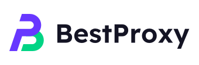
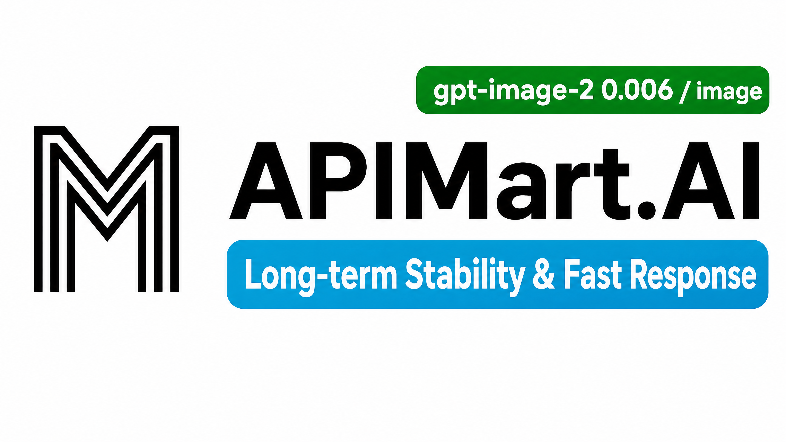

# CLIProxyAPI Plus

English | [中文](README_CN.md) | [日本語](README_JA.md)

CLIProxyAPI Plus is a combined distribution built from:

- `router-for-me/CLIProxyAPI`, the upstream proxy server.
- `Tonkic/CLIProxyAPIPlus`, the Plus fork with extra providers and deployment packaging.
- `seakee/CPA-Manager-Plus`, an external management and usage dashboard bundled in release archives.
- Local integration code that exposes usage events through a Redis-compatible queue so the proxy and manager can run together as one product.

The goal is to keep the upstream CLIProxyAPI runtime compatible while adding Plus-specific providers, account management, usage collection, and easy deployment scripts.

## What Is Included

- OpenAI, Gemini, Claude, Codex, Grok, and Responses-compatible HTTP APIs.
- OAuth and token login flows for Codex, Claude, Gemini, Kimi, Antigravity, xAI/Grok, GitHub Copilot, Kiro, Cursor, CodeBuddy, Kilo, iFlow, and GitLab Duo.
- Round-robin and fill-first account selection with model aliases and hot reload.
- Amp CLI and Amp IDE extension routing through provider-specific API paths.
- WebSocket support where supported by the upstream provider.
- Request logging, management APIs, and a browser-based management panel.
- Redis-compatible usage queue for external collectors.
- Release packaging that can run CLIProxyAPI Plus and CPA-Manager-Plus together.

## Project Layout

```text
cmd/server/                  CLI entrypoint
internal/api/                Gin server, routes, middleware, management API
internal/api/modules/amp/    Amp-specific routes and reverse proxy helpers
internal/runtime/executor/   Provider executors
internal/translator/         Protocol translators
internal/redisqueue/         Redis-compatible usage queue plugin
sdk/cliproxy/                Embeddable proxy service
sdk/cliproxy/usage/          Usage event manager and plugin interface
manager/                     CPA-Manager-Plus binary and persistent data
docs/                        SDK and provider documentation
```

## Usage Collection

CLIProxyAPI Plus records usage events in the runtime and publishes them through `sdk/cliproxy/usage`. The `internal/redisqueue` plugin serializes each usage record and stores it in an in-memory queue.

The API server accepts Redis RESP connections on the same listening port as the proxy. Consumers authenticate with the management key and read events with `LPOP` or `RPOP`.

CPA-Manager-Plus consumes that queue and provides persistent storage, service management, and visualization.

<table>
<tbody>
<tr>
<td width="180"><a href="https://www.aicodemirror.ai/register?invitecode=TJNAIF"></a></td>
<td>Thanks to AICodeMirror for sponsoring this project! AICodeMirror provides official high-stability relay services for Claude Code / Codex / Gemini, with enterprise-grade concurrency, fast invoicing, and 24/7 dedicated technical support. Claude Code / Codex / Gemini official channels at 38% / 2% / 9% of original price, with extra discounts on top-ups! AICodeMirror offers special benefits for CLIProxyAPI users: register via <a href="https://www.aicodemirror.ai/register?invitecode=TJNAIF">this link</a> to enjoy 20% off your first top-up, and enterprise customers can get up to 25% off!</td>
</tr>
<tr>
<td width="180"><a href="https://shop.bmoplus.com/?utm_source=github"></a></td>
<td>Huge thanks to BmoPlus for sponsoring this project! BmoPlus is a highly reliable AI account provider built strictly for heavy AI users and developers. They offer rock-solid, ready-to-use accounts and official top-up services for ChatGPT Plus / ChatGPT Pro (Full Warranty) / Claude Pro / Super Grok / Gemini Pro. By registering and ordering through <a href="https://shop.bmoplus.com/?utm_source=github">BmoPlus - Premium AI Accounts & Top-ups</a>, users can unlock the mind-blowing rate of <b>10% of the official GPT subscription price (90% OFF)</b>!</td>
</tr>
<tr>
<td width="180"><a href="https://apikey.fun/register?aff=CLIProxyAPI"></a></td>
<td>Thanks to APIKEY.FUN for sponsoring this project! APIKEY.FUN is a professional enterprise-grade AI relay platform dedicated to providing stable, efficient, and low-cost AI model API access for enterprises and individual developers. The platform supports popular mainstream models such as Claude, OpenAI, and Gemini, with prices as low as 7% of the official price. Register through this project's <a href="https://apikey.fun/register?aff=CLIProxyAPI">exclusive link</a> to enjoy a special <b>permanent 5% top-up discount</b>.</td>
</tr>
<tr>
<td width="180"><a href="https://runapi.host/register?aff=FivD"></a></td>
<td>RunAPI is an efficient and stable API platform—an alternative to OpenRouter. A single API Key gives you access to 150+ leading models, including OpenAI, Claude, Gemini, DeepSeek, Grok, and more, at prices as low as 10% of the original (up to 90% off), with exceptional stability. It's seamlessly compatible with tools like Claude Code, OpenClaw, and others. RunAPI offers an exclusive perk for CPA users: <a href="https://runapi.host/register?aff=FivD">register</a> and contact an administrator to claim ¥7 in free credit.</td>
</tr>
<tr>
<td width="180"><a href="https://t.me/CyberWlD/218"></a></td>
<td>CyberPay was founded in 2021. We are committed to providing stable, efficient, and secure payment settlement solutions for AI industry merchants. Working with us helps your website platform solve Alipay and WeChat payment collection needs. We support business cooperation for selling GPT, Gemini, Claude, and Codex accounts, relay platforms, and other related services, helping merchants address payment collection challenges. <a href="https://t.me/CyberWlD/218">Contact us</a> to start your path to growth.</td>
</tr>
<tr>
<td width="180"><a href="https://console.apito.ai/agent/register/pJq9T52Fpugrhpgo"></a></td>
<td>Thanks to <a href="https://console.apito.ai/agent/register/pJq9T52Fpugrhpgo">Claude API</a> for sponsoring this project! Claude API is an official-channel API provider focused on Claude models. Built on Anthropic official keys and AWS Bedrock official channels, it provides a stable integration experience for Claude Code and Agent applications, supports the full Claude model family, and preserves official capabilities such as Tool Use and long context. The service is not reverse-engineered and does not downgrade model capabilities, making it suitable for heavy Claude Code users, Agent engineers, and enterprise technical teams. Register through the <a href="https://console.apito.ai/agent/register/pJq9T52Fpugrhpgo">Exclusive link</a> and contact customer support to claim free test credits. Invoicing and team onboarding are also supported.</td>
</tr>
<tr>
<td width="180"><a href="https://code0.ai/agent/register/slxVMR3uVBoRgNBf"></a></td>
<td>Thanks to <a href="https://code0.ai/agent/register/slxVMR3uVBoRgNBf">Code0</a> for sponsoring this project! code0.ai is an AI coding workspace for developers and technical teams, bringing together mainstream Agent coding capabilities such as Claude Code and Codex. It supports common development scenarios including code generation, project understanding, debugging, code review, and documentation. It is suitable for independent developers, Agent engineers, open-source maintainers, and enterprise R&D teams, with invoicing and team onboarding supported. Register through the <a href="https://code0.ai/agent/register/slxVMR3uVBoRgNBf">Exclusive link</a> and contact customer support to claim free test credits and experience a more efficient AI coding workflow.</td>
</tr>
<tr>
<td width="180"><a href="https://api.fenno.ai/s/Cvf0"></a></td>
<td>FennoAI is a stable and efficient API relay service provider, currently focused on Codex relay services. It is compatible with OpenAI and Anthropic protocols and can flexibly integrate with mainstream coding tools such as Codex, Claude Code, and OpenCode. It can reliably support enterprise-grade demand of hundreds of billions of tokens per day, with B2B settlement and invoicing available for both domestic and overseas entities. FennoAI offers an exclusive benefit for CLIProxyAPI users: purchase a subscription through the <a href="https://api.fenno.ai/s/Cvf0">exclusive link</a> and receive $50 worth of Coding Plan credits for just $1.99. Referral rewards are also available: earn up to 20% commission when invited friends make a purchase. The more friends you invite, the greater the rewards.</td>
</tr>
<tr>
<td width="180"><a href="https://s.qiniu.com/7zUJri"></a></td>
<td>Thanks to <a href="https://s.qiniu.com/7zUJri">Qiniu Cloud AI</a> for sponsoring this project! Qiniu Cloud AI is an enterprise-grade large-model MaaS platform under Qiniu Cloud (02567.HK). It provides one-stop access to 150+ mainstream global models, is compatible with protocols from major global model providers, and covers full-modal processing capabilities for text, image, audio, video, and files. It serves more than 1.69 million enterprise and developer users. Exclusive benefits: enterprise users can claim 12 million free tokens, and invite friends to earn up to tens of billions of tokens.</td>
</tr>
<tr>
<td width="180"><a href="https://cubence.com/signup?code=CLIPROXYAPI&source=cpa"></a></td>
<td>Thanks to Cubence for sponsoring this project! Cubence is a reliable and efficient API relay service provider, offering relay services for Claude Code, Codex, Gemini, and more. Cubence provides special discounts for our software users: register using <a href="https://cubence.com/signup?code=CLIPROXYAPI&source=cpa">this link</a> and enter the "CLIPROXYAPI" promo code during recharge to get 10% off.</td>
</tr>
<tr>
<td width="180"><a href="https://www.fastaitoken.com/"></a></td>
<td>Thanks to <a href="https://www.fastaitoken.com/">FastAIToken</a> for sponsoring this project! FastAIToken is an AI API aggregation platform built for developers, focused on speed and stability. It supports leading AI models including OpenAI, Claude, Gemini, and more. With a 1:1 recharge ratio (¥1 = $1 in API credits), developers can access the world's top AI models at lower cost and with greater convenience. <a href="https://t.me/+stwq0MLi0PtkZTZl">Telegram Support Group</a><br/>The platform offers multiple channels to suit different needs: an ultra-low-cost 0.02× OpenAI promotional tier (limited time), OpenAI channels starting from 0.25×, 0.7× Claude with 95% fixed cache, and 1.2× Claude Max channels. It also provides a public status page displaying real-time availability, latency, and operational status for every channel, ensuring transparent and reliable service. In addition, FastAIToken offers 24/7 human technical support (no bots) for rapid response to developers' needs. For enterprise customers, dedicated SLA-backed channel pools are available with guaranteed stability, contract support, invoicing, and dedicated maintenance.</td>
</tr>
<tr>
<td width="180"><a href="https://api.lmuai.ai/register?promo=CLIPROXYAPI-%E4%BC%98%E6%83%A0%E7%A0%81"></a></td>
<td>Thanks to <a href="https://api.lmuai.ai/register?promo=CLIPROXYAPI-%E4%BC%98%E6%83%A0%E7%A0%81">LMU (灵眸 AI)</a> for sponsoring this project! LMU is an Anthropic- and OpenAI-compatible relay for Claude Code, Codex, and other coding agents, covering both domestic models (DeepSeek, GLM, Qwen, and more) and major overseas providers. Point <code>ANTHROPIC_BASE_URL</code> at the LMU endpoint and connect over the standard <code>/v1/messages</code> API with no code changes. Real-world Prompt Cache hit rates run above 90% in Claude Code sessions, cutting long-session costs. Unused recharge balance is refundable on request. Enterprise plans include grouped, team-managed API keys with configurable IP/quota limits, rate windows, and expiry, plus traffic monitoring and invoicing. Register through the <a href="https://api.lmuai.ai/register?promo=CLIPROXYAPI-%E4%BC%98%E6%83%A0%E7%A0%81">LMU CLIProxyAPI exclusive link</a> to claim free test credits.</td>
</tr>
<tr>
<td width="180"><a href="https://www.infistar.cc/register?aff=FQKC6J6R&ref_source=link"></a></td>
<td>Worried about diluted or downgraded models, or opaque pricing? Infistar.ai, a globally leading model aggregation service, verifies every model it offers through real API calls. Its supply comes from official APIs and official account pools, with load balancing across more than 10,000 supply routes to ensure low latency and stability during peak periods. It covers leading models worldwide, including ChatGPT, Claude, Gemini, Grok, GLM, DeepSeek, Kimi, Qwen, and MiniMax, with full-modal capabilities spanning text, video, images, embeddings, reranking, and more. Pricing and usage are transparent, clear, and easy to inspect, with models available from as little as 10% of official prices. CLIProxyAPI users can register and try the service through the exclusive entry. Invitation link: <a href="https://www.infistar.cc/register?aff=FQKC6J6R&ref_source=link">https://www.infistar.cc/register?aff=FQKC6J6R&ref_source=link</a></td>
</tr>
<tr>
<td width="180"><a href="https://bestproxy.com/?keyword=ayh7otlb"></a></td>
<td>Bestproxy provides high-purity residential IPs with dedicated one-IP-per-account support. 🟡Residential Proxy - &#36;0.5/GB；🟡Static Residential Proxy - Starting at &#36;3/IP；🟡Unlimited Residential Proxy - Starting at &#36;67/Day.  ✅<a href="https://bestproxy.com/?keyword=ayh7otlb">Get Free Trial.</a></td>
</tr>
<tr>
<td width="180"><a href="https://go.apimart.ai/gh-cliproxyapi"></a></td>
<td>Thanks to APIMart for sponsoring this project! APIMart is a low-cost API platform for AI image &amp; video generation — GPT-Image-2 from &#36;0.006/image, 160+ images per dollar. One async API covers both image and video: submit a task, get an ID, fetch results via polling or callback. Batch tens of thousands of images without timeouts, switch models without changing code. Pay-as-you-go with no monthly fee — <a href="https://go.apimart.ai/gh-cliproxyapi">sign up here</a> to get started.</td>
</tr>
</tbody>
</table>

```text
client -> CLIProxyAPI Plus :8317 -> Redis-compatible usage queue
                              |
                              v
                         CPA-Manager-Plus :18317
```

Configure the proxy:

```yaml
remote-management:
  secret-key: "change-me"

usage-statistics-enabled: true
redis-usage-queue-retention-seconds: 60
```

After the first start, open `http://SERVER_IP:18317/management.html`. Use the generated CPA-Manager-Plus admin key, then add CLIProxyAPI Plus with URL `http://127.0.0.1:8317` and the configured management key. The manager defaults to `USAGE_COLLECTOR_MODE=auto`.

## Getting Started

Copy the example config and edit it for your accounts and providers:

```bash
cp config.example.yaml config.yaml
```

Run from source:

```bash
go run ./cmd/server --config ./config.yaml
```

Build a local binary:

```bash
go build -o cli-proxy-api-plus ./cmd/server
```

Run the built binary:

```bash
./cli-proxy-api-plus --config ./config.yaml
```

## Running With CPA-Manager-Plus

Release archives include short Linux helper scripts and the CPA-Manager-Plus binary:

Windows ZIP archives keep `start.cmd` at the root and place all operational scripts under `windows\`. On the first run, `.\start.cmd` creates `config.yaml` from the template and exits so you can replace the placeholder API keys and review the listening address; run it again to start CPA and CPA-Manager-Plus. Use `.\windows\restart.cmd`, `.\windows\stop.cmd`, or `.\windows\update.cmd -Tag VERSION` for maintenance. Linux archives likewise keep only `start.sh` at the root and place the full script set under `linux/`.

```text
CLIProxyAPIPlus_<version>_linux_<arch>/
|-- cli-proxy-api-plus
|-- config.example.yaml
|-- start.sh
|-- linux/
|   |-- start.sh
|   |-- stop.sh
|   |-- restart.sh
|   `-- update.sh
`-- manager/
    `-- cpa-manager-plus
```

Initial setup:

```bash
cp config.example.yaml config.yaml
./start.sh
```

Service control:

```bash
./start.sh
./linux/stop.sh
./linux/restart.sh
```

The helper starts:

- CLIProxyAPI Plus at `http://127.0.0.1:8317`
- CPA-Manager-Plus at `http://127.0.0.1:18317`

On its first run, CPA-Manager-Plus prints a generated `cpamp_...` admin key. Read it from:

```bash
tail -n 200 logs/cpa-manager-plus.out.log
tail -n 200 logs/cpa-manager-plus.err.log
```

The manager keeps persistent state in `manager/data/` and `manager/config.json`. Back up `manager/data/usage.sqlite*` and `manager/data/data.key`. Updates replace only the manager binary and preserve these files.

## Deployment Updates

GitHub Releases are the default download source:

```bash
./linux/update.sh --tag v7.2.91.1
```

To install only and restart manually:

```bash
./linux/update.sh \
  --tag v7.2.91.1 \
  --no-restart

./linux/restart.sh
```

Aliyun OSS remains available as an optional mirror by passing `--bucket` and `--endpoint`:

```bash
./linux/update.sh \
  --tag v7.2.91.1 \
  --bucket update-cpa-plus \
  --endpoint oss-cn-shenzhen.aliyuncs.com
```

## Amp CLI Support

CLIProxyAPI Plus supports Amp CLI and Amp IDE extension route shapes:

- `/api/provider/{provider}/v1/messages`
- `/api/provider/{provider}/v1beta/models/...`
- `/api/provider/{provider}/v1/chat/completions`

It also provides management proxy support, model fallback, model mappings, and localhost restrictions for sensitive Amp management routes.

## SDK Docs

- Usage: [docs/sdk-usage.md](docs/sdk-usage.md)
- Advanced executors and translators: [docs/sdk-advanced.md](docs/sdk-advanced.md)
- Access control: [docs/sdk-access.md](docs/sdk-access.md)
- Credential watcher: [docs/sdk-watcher.md](docs/sdk-watcher.md)
- Custom provider example: `examples/custom-provider`

## Build And Test

```bash
gofmt -w .
go build -o test-output ./cmd/server
rm -f test-output
go test ./...
```

## Release

Releases use the upstream CLIProxyAPI version plus a Plus counter, for example `v7.0.6.1`. The release workflow builds Linux and Windows archives for amd64 and arm64 and includes the updater scripts plus the matching CPA-Manager-Plus binary.

## Upstream Projects

- CLIProxyAPI: `https://github.com/router-for-me/CLIProxyAPI`
- CLIProxyAPI Plus: `https://github.com/Tonkic/CLIProxyAPIPlus`
- CPA-Manager-Plus: `https://github.com/seakee/CPA-Manager-Plus`

## License

This project is licensed under the MIT License. See [LICENSE](LICENSE) for details.
