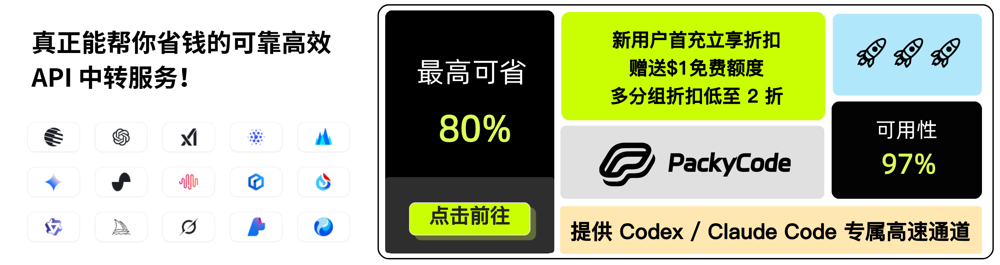
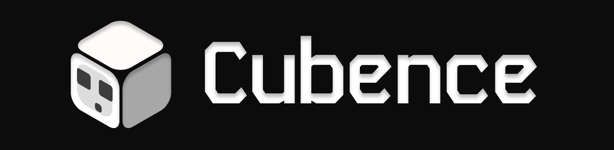
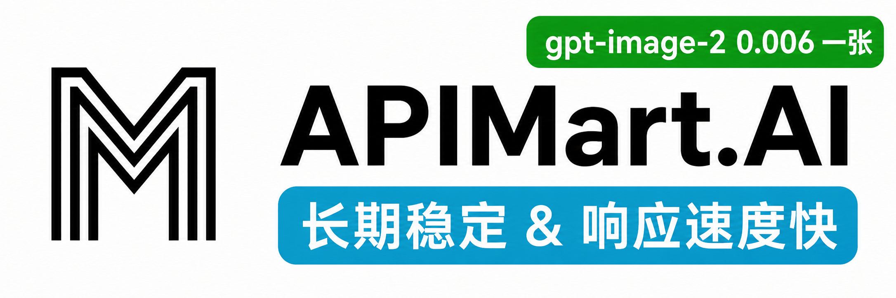

# CLIProxyAPI Plus

[English](README.md) | 中文 | [日本語](README_JA.md)

如果您想在您的桌面使用 CLIProxyAPI，我们推荐您使用我们的 [EasyCLIProxyAPI](https://github.com/router-for-me/EasyCLIProxyAPI) 桌面客户端，该客户端提供了图形化的配置界面、自动更新、系统托盘集成、一键启动/关闭 CLIProxyAPI 服务等功能。

CLIProxyAPI 是一个为 CLI 提供 OpenAI/Gemini/Claude/Codex/Grok 兼容 API 接口的代理服务器。

您可以通过任何与 OpenAI（包括 Responses）、Gemini（包括 Interactions）或 Claude 兼容的客户端或 SDK，以本地方式或多 CLI 账户访问以下提供商。

<table>
<tbody>
    <tr>
        <th align="center" width="100">提供商</th>
        <th align="center">说明</th>
    </tr>
    <tr>
        <td align="center"><a href="https://www.kimi.com/code/?aff=cliproxyapi"></a></td>
        <td>Kimi 系列模型（Kimi K3、K2.7 Code 等）。<a href="https://platform.kimi.com/docs/guide/kimi-k3-quickstart">Kimi K3</a> 是 Moonshot AI 迄今能力最强的模型，也是全球首个开源 3T 级模型。K3 拥有 2.8T 参数、原生视觉能力与 100 万 Token 上下文，面向长周期编码、知识工作与推理任务。CLIProxyAPI 支持通过 OAuth 或兼容 API 接入 Kimi。立即体验 <a href="https://www.kimi.com/code/?aff=cliproxyapi">Kimi Code 订阅</a>，或前往 <a href="https://platform.kimi.com?track_id=track-f15622e7182046baa22ca35e006e13a7&aff=cliproxyapi">Kimi 开放平台</a> 获取 API Key。感谢 Kimi 对 CLIProxyAPI 及开源社区的支持！</td>
    </tr>
    <tr>
        <td align="center"><a href="https://platform.openai.com/docs/guide/gpt-5.6"></a></td>
        <td>OpenAI GPT 系列模型（GPT 5.6、GPT 5.5 等）。GPT-5.6 为复杂生产工作流树立了新的质量与效率基线。GPT-5.6 尤其节省 token，并提升了前端审美表现，包括布局、视觉层级与设计判断力。</td>
    </tr>
    <tr>
        <td align="center"><a href="https://www.anthropic.com/claude"></a></td>
        <td>Anthropic Claude 系列模型（Claude Fable、Claude Opus、Claude Sonnet 等）。Claude Fable 5 是 Anthropic 公开发布中能力最强的模型，专为最严苛的推理与长周期智能体任务打造。</td>
    </tr>
    <tr>
        <td align="center"><a href="https://antigravity.google/"></a></td>
        <td>Google Gemini 系列模型（Gemini 3.5 Flash、Gemini 3.1 Pro 等）。Gemini 3.5 Flash 提供面向真实世界任务优化的持续前沿级智能，速度更快、成本更低。面向智能体时代设计，擅长子智能体部署、多步骤工作流以及大规模长周期任务。该模型尤其适合包含复杂编码循环与迭代的快速智能体回路。</td>
    </tr>
    <tr>
        <td align="center"><a href="https://x.ai/grok"></a></td>
        <td>xAI Grok 系列模型（Grok 4.5、Grok Composer 2.5 Fast 等）。Grok 4.5 是 SpaceXAI 面向编程、智能体任务与知识工作打造的前沿模型。它在 SpaceXAI 位于孟菲斯的数据中心训练，并使用了覆盖科学、工程与数学的新数据集。</td>
    </tr>
</tbody>
</table>

## 赞助商

[](https://www.packyapi.com/register?aff=cliproxyapi)

感谢 PackyCode 对本项目的赞助！

PackyCode 是一家可靠高效的 API 中转服务商，提供 Claude Code、Codex、Gemini 等多种服务的中转。

PackyCode 为本软件用户提供了特别优惠：使用<a href="https://www.packyapi.com/register?aff=cliproxyapi" target="_blank">此链接</a>注册，并在充值时输入 "cliproxyapi" 优惠码即可享受九折优惠。

---

<table>
<tbody>
<tr>
<td width="180"><a href="https://www.aicodemirror.ai/register?invitecode=TJNAIF"></a></td>
<td>感谢 AICodeMirror 赞助了本项目！AICodeMirror 提供 Claude Code / Codex / Gemini 官方高稳定中转服务，支持企业级高并发、极速开票、7×24 专属技术支持。 Claude Code / Codex / Gemini 官方渠道低至 3.8 / 0.2 / 0.9 折，充值更有折上折！AICodeMirror 为 CLIProxyAPI 的用户提供了特别福利，通过<a href="https://www.aicodemirror.ai/register?invitecode=TJNAIF" target="_blank">此链接</a>注册的用户，可享受首充8折，企业客户最高可享 7.5 折！</td>
</tr>
<tr>
<td width="180"><a href="https://shop.bmoplus.com/?utm_source=github"></a></td>
<td>感谢 BmoPlus 赞助了本项目！BmoPlus 是一家专为AI订阅重度用户打造的可靠 AI 账号代充服务商，提供稳定的 ChatGPT Plus / ChatGPT Pro(全程质保) / Claude Pro / Super Grok / Gemini Pro 的官方代充&成品账号。 通过<a href="https://shop.bmoplus.com/?utm_source=github" target="_blank">BmoPlus AI成品号专卖/代充</a>注册下单的用户，可享GPT <b>官网订阅一折</b> 的震撼价格！</td>
</tr>
<tr>
<td width="180"><a href="https://apikey.fun/register?aff=CLIProxyAPI"></a></td>
<td>感谢 APIKEY.FUN 赞助本项目！APIKEY.FUN 是一家专业的企业级 AI 中转站，致力于为企业和个人开发者提供稳定、高效、低成本的 AI 模型 API 接入服务。平台支持 Claude、OpenAI、Gemini 等主流热门模型，价格低至官方原价的 7%。通过本项目<a href="https://apikey.fun/register?aff=CLIProxyAPI">专属链接</a>注册，还可享受最高 <b>充值永久 95 折</b> 专属优惠。</td>
</tr>
<tr>
<td width="180"><a href="https://runapi.host/register?aff=FivD"></a></td>
<td>RunAPI 是高效稳定的API OpenRouter平替平台，一个 API Key 即可访问 OpenAI、Claude、Gemini、DeepSeek、Grok 等 150+ 主流模型，低至 1 折，极其稳定，可以无缝兼容 Claude Code、OpenClaw 等工具。RunAPI 为 CPA的用户提供专属福利：<a href="https://runapi.host/register?aff=FivD">注册</a>联系管理员即可领取￥7的免费额度</td>
</tr>
<tr>
<td width="180"><a href="https://t.me/CyberWlD/218"></a></td>
<td>赛博支付（CyberPay）成立于2021年。我们致力于为AI从业者商家提供稳定、高效、安全的支付结算解决方案。与我们合作即可使您的网站平台解决用户支付宝/微信收款问题。承接售卖GPT 、Gemini、Claude、Codex账号与中转站等各类业务合作，解决各位商家收款困难痛点。<a href="https://t.me/CyberWlD/218">联系我们</a>开启您的致富通道。</td>
</tr>
<tr>
<td width="180"><a href="https://console.apito.ai/agent/register/pJq9T52Fpugrhpgo"></a></td>
<td>感谢 <a href="ugrhpghttps://console.apito.ai/agent/register/pJq9T52Fpugrhpgo">Claude API</a> 赞助本项目！Claude API 是专注 Claude 模型的官方渠道 API 服务商，基于 Anthropic 官方 Key 与 AWS Bedrock 官方渠道，提供稳定的 Claude Code 与 Agent 应用接入体验，支持 Claude 全系列模型，保留 Tool Use、长上下文等官方能力。服务非逆向、非降智，适合 Claude Code 深度用户、Agent 工程师与企业技术团队使用。通过<a href="https://console.apito.ai/agent/register/pJq9T52Fpugrhpgo">专属链接</a>注册后联系客服，可领取免费测试额度，并支持开票和团队对接。</td>
</tr>
<tr>
<td width="180"><a href="https://code0.ai/agent/register/slxVMR3uVBoRgNBf"></a></td>
<td>感谢 <a href="https://code0.ai/agent/register/slxVMR3uVBoRgNBf">Code0</a> 赞助本项目！code0.ai 是面向开发者与技术团队的 AI 编程工作台，聚合 Claude Code、Codex 等主流 Agent 编程能力，支持代码生成、项目理解、调试修复、代码审查与文档生成等常见研发场景。适合独立开发者、Agent 工程师、开源项目维护者和企业研发团队使用，支持开票和团队对接。通过<a href="https://code0.ai/agent/register/slxVMR3uVBoRgNBf">专属链接</a>注册后联系客服，可领取免费测试额度，体验更高效的 AI 编程工作流。</td>
</tr>
<tr>
<td width="180"><a href="https://api.fenno.ai/s/Cvf0"></a></td>
<td>FennoAI 是一家稳定、高效的API 中转服务商，目前主要提供 Codex 中转服务，兼容OpenAI 及 Anthropic 协议，可灵活接入 Codex、Claude Code、OpenCode等主流编程工具，可稳定支撑千亿Token/日的企业级调用需求，支持国内及海外主体公对公结算、开票。FennoAI 为 CLIProxyAPI 的用户提供了专属福利：通过<a href="https://api.fenno.ai/s/Cvf0">专属链接</a>购买订阅，仅需 1.99 美元即可获得价值 50 美元的 Coding Plan 额度。同时支持邀请奖励，邀请好友购买最高可获得 20% 返佣，邀请越多，奖励越高。</td>
</tr>
<tr>
<td width="180"><a href="https://s.qiniu.com/7zUJri"></a></td>
<td>感谢 <a href="https://s.qiniu.com/7zUJri">七牛云AI</a> 赞助本项目！七牛云AI 是七牛云(02567.HK)旗下企业级大模型MaaS平台，一站式调用全球 150+ 主流模型，兼容全球主流模型厂商协议，覆盖文本、图像、音频、视频、文件处理等全模态处理能力，服务超过 169 万企业及开发者用户。专属福利：企业用户免费领 <b>1200万 Token</b>，邀请好友最高得百亿 Token。</td>
</tr>
<tr>
<td width="180"><a href="https://cubence.com/signup?code=CLIPROXYAPI&source=cpa"></a></td>
<td>感谢 Cubence 对本项目的赞助！Cubence 是一家可靠高效的 API 中转服务商，提供 Claude Code、Codex、Gemini 等多种服务的中转。Cubence 为本软件用户提供了特别优惠：使用<a href="https://cubence.com/signup?code=CLIPROXYAPI&source=cpa">此链接</a>注册，并在充值时输入 "CLIPROXYAPI" 优惠码即可享受九折优惠。</td>
</tr>
<tr>
<td width="180"><a href="https://www.fastaitoken.com/"></a></td>
<td>感谢 <a href="https://www.fastaitoken.com/">FastAIToken</a> 对本项目的赞助！ FastAIToken 是面向开发者的 AI API 聚合平台，追求极速、稳定。支持 OpenAI、Claude、Gemini 等主流大模型，充值 1:1，1 元 = 1 美元 API 额度，让开发者以更低成本、更便捷地使用全球领先的大模型服务，QQ服务群1054566214。<br/>平台提供多种渠道自由选择：超级低价的0.02x OpenAI 福利分组（限时）、低至 0.25x OpenAI 分组、0.7x Claude 95%固定缓存、1.2x Claude Max 渠道；同时提供公开状态页，实时展示各分组的可用率、延迟及运行状态，服务透明可靠，并提供 7×24 小时真人技术支持（非机器人），快速响应开发者需求。针对企业用户可以构建SLA专线号池，包稳定，可签合同开票专人维护。</td>
</tr>
<tr>
<td width="180"><a href="https://api.lmuai.ai/register?promo=CLIPROXYAPI-%E4%BC%98%E6%83%A0%E7%A0%81"></a></td>
<td>感谢 <a href="https://api.lmuai.ai/register?promo=CLIPROXYAPI-%E4%BC%98%E6%83%A0%E7%A0%81">LMU（灵眸 AI）</a> 对本项目的赞助！LMU 是兼容 Anthropic 和 OpenAI 协议的 AI 中转服务，适用于 Claude Code、Codex 及其他编程智能体，覆盖国内模型（DeepSeek、GLM、Qwen 等）和主流海外提供商。只需将 <code>ANTHROPIC_BASE_URL</code> 指向 LMU 端点，即可无需修改代码，通过标准 <code>/v1/messages</code> API 接入。Claude Code 实际会话中的 Prompt Cache 命中率超过 90%，可有效降低长会话成本。未使用的充值余额可申请退款。企业版提供分组及团队管理的 API Key，可配置 IP/额度限制、速率窗口和有效期，并支持流量监控与开票。通过 <a href="https://api.lmuai.ai/register?promo=CLIPROXYAPI-%E4%BC%98%E6%83%A0%E7%A0%81">LMU CLIProxyAPI 专属链接</a>注册，即可领取免费测试额度。</td>
</tr>
<tr>
<td width="180"><a href="https://www.infistar.cc/register?aff=FQKC6J6R&ref_source=link"></a></td>
<td>担心模型掺水、降智或价格不透明？全球领先模型聚合服务Infistar.ai，在售模型均经过真实调用验真，供给来自官方 API 与官方号池，超10000条供应链路进行负载均衡，保证时延和峰时稳定性。覆盖 ChatGPT、Claude、Gemini、Grok、GLM、DeepSeek、Kimi、Qwen、MiniMax等国内外主流模型，覆盖文本，视频，图片，嵌入，重排等全模态能力，价格与用量透明清晰可查，模型低至官方价的 10%。CLIProxyAPI 用户可通过专属入口注册体验 邀请链接：<a href="https://www.infistar.cc/register?aff=FQKC6J6R&ref_source=link">https://www.infistar.cc/register?aff=FQKC6J6R&ref_source=link</a></td>
</tr>
<tr>
<td width="180"><a href="https://go.apimart.ai/gh-cliproxyapi"></a></td>
<td>感谢 APIMart 赞助了本项目！APIMart 是专注 AI 图片/视频生成的低价 API 平台，GPT-Image-2 低至 &#36;0.006/张，1 美元可出图 160+ 张。图片、视频一套异步 API 通吃，提交任务拿 ID、回调取结果，跑批万张不超时、换模型不改代码。按量付费、无月费，通过<a href="https://go.apimart.ai/gh-cliproxyapi">此注册链接</a>注册即可开用。</td>
</tr>
</tbody>
</table>


## 功能特性

- 为 CLI 模型提供 OpenAI/Gemini/Claude/Codex/Grok 兼容的 API 端点
- 新增 OpenAI Codex（GPT 系列）支持（OAuth 登录）
- 新增 Claude Code 支持（OAuth 登录）
- 新增 Grok Build 支持（OAuth 登录）
- 支持流式、非流式响应，以及受支持场景下的 WebSocket 响应
- 函数调用/工具支持
- 多模态输入（文本、图片）
- 多账户支持与轮询负载均衡（Gemini、OpenAI、Claude、Grok）
- 简单的 CLI 身份验证流程（Gemini、OpenAI、Claude、Grok）
- 支持 Gemini AIStudio API 密钥
- 支持 AI Studio Build 多账户轮询
- 支持 Claude Code 多账户轮询
- 支持 OpenAI Codex 多账户轮询
- 支持 Grok Build 多账户轮询
- 通过配置接入上游 OpenAI 兼容提供商（例如 OpenRouter）
- 可复用的 Go SDK（见 `docs/sdk-usage_CN.md`）

- `router-for-me/CLIProxyAPI`：上游代理服务核心。
- `Tonkic/CLIProxyAPIPlus`：Plus 分支，增加额外 provider、登录能力和部署打包。
- `seakee/CPA-Manager-Plus`：外部管理和用量看板，在 release 包中以二进制形式随包发布。
- 本仓库的集成代码：把代理运行时的用量事件输出成 Redis 兼容队列，让主代理和 manager 可以作为一个产品一起运行。

目标是在保持上游 CLIProxyAPI 兼容性的基础上，提供 Plus provider、多账号管理、用量统计和更省心的部署体验。

## 功能

- OpenAI、Gemini、Claude、Codex、Grok、Responses 兼容接口。
- 支持 Codex、Claude、Gemini、Kimi、Antigravity、xAI/Grok、GitHub Copilot、Kiro、Cursor、CodeBuddy、Kilo、iFlow、GitLab Duo 等登录或 token 接入。
- 支持 round-robin / fill-first 账号选择、模型别名和热重载。
- 支持 Amp CLI 和 Amp IDE 扩展的 provider 路由。
- 支持部分 provider 的 WebSocket。
- 提供请求日志、Management API 和管理面板。
- 提供 Redis 兼容用量队列，可供外部 collector 消费。
- release 包可同时启动 CLIProxyAPI Plus 和 CPA-Manager-Plus。

## 项目结构

```text
cmd/server/                  CLI 入口
internal/api/                Gin server、路由、中间件、Management API
internal/api/modules/amp/    Amp 路由和反向代理
internal/runtime/executor/   provider executor
internal/translator/         协议转换器
internal/redisqueue/         Redis 兼容用量队列插件
sdk/cliproxy/                可嵌入的代理服务
sdk/cliproxy/usage/          用量事件管理器和插件接口
manager/                     CPA-Manager-Plus 二进制和持久化数据
docs/                        SDK 和 provider 文档
```

## 用量统计

CLIProxyAPI Plus 在运行时生成 usage record，并通过 `sdk/cliproxy/usage` 发布。`internal/redisqueue` 插件会把这些记录序列化为 JSON，放入内存队列。

API server 会在代理端口上同时接受 Redis RESP 协议连接。消费者使用 management key 认证后，可以用 `LPOP` 或 `RPOP` 读取事件。

CPA-Manager-Plus 负责消费这个队列，并提供持久化、服务管理和可视化。

默认链路：

```text
client -> CLIProxyAPI Plus :8317 -> Redis-compatible usage queue
                              |
                              v
                         CPA-Manager-Plus :18317
```

代理配置示例：

```yaml
remote-management:
  secret-key: "change-me"

usage-statistics-enabled: true
redis-usage-queue-retention-seconds: 60
```

首次启动后，打开 `http://服务器IP:18317/management.html`。使用自动生成的 CPA-Manager-Plus 管理密钥登录，然后添加 CLIProxyAPI Plus：地址填写 `http://127.0.0.1:8317`，密钥填写 CPA 配置中的 management key。manager 默认使用 `USAGE_COLLECTOR_MODE=auto`。

## 快速开始

复制配置模板并按需填写账号和 provider：

```bash
cp config.example.yaml config.yaml
```

源码运行：

```bash
go run ./cmd/server --config ./config.yaml
```

构建并运行：

```bash
go build -o cli-proxy-api-plus ./cmd/server
./cli-proxy-api-plus --config ./config.yaml
```

## API Key 与凭证池绑定

使用 `api-key-auth-bindings` 可以限制某些客户端 API Key 只能使用指定的认证凭证。例如，让团队专用 Key 只能使用两个 Team 账号：

```yaml
api-keys:
  - sk-public-normal
  - sk-team-exclusive

api-key-auth-bindings:
  - api-keys:
      - sk-team-exclusive
    auth-ids:
      - codex-team-account-a.json
      - codex-team-account-b.json
```

对于文件型认证凭证，`auth-ids` 通常就是认证目录中的 JSON 文件名，也可以通过管理接口返回的 auth ID 确认实际值。

- `sk-team-exclusive` 只能在两个 Team 凭证之间调度和故障切换。
- 普通 API Key 无法使用任何绑定中列出的受保护凭证。
- 专用凭证全部不可用时不会回退到公共凭证池。
- 同一个 API Key 出现在多个绑定中时，其 `auth-ids` 会合并。
- 匹配的绑定没有有效 `auth-ids` 时，该 API Key 无法使用任何凭证。
- 修改绑定配置后会随配置热加载生效，无需重启服务。

不要把真实 API Key 提交到公开仓库。完整注释示例也可以在 `config.example.yaml` 中找到。

## 与 CPA-Manager-Plus 一起运行

release 包包含简短的 Linux 辅助脚本和 CPA-Manager-Plus 二进制：

Windows ZIP 根目录只保留 `start.cmd`，完整运维脚本位于 `windows\`。首次运行 `.\start.cmd` 会从模板创建 `config.yaml` 并退出，请先替换占位 API Key、确认监听地址，再次运行即可启动 CPA 与 CPA-Manager-Plus。日常维护使用 `.\windows\restart.cmd`、`.\windows\stop.cmd` 或 `.\windows\update.cmd -Tag VERSION`。Linux 包同样只在根目录保留 `start.sh`，其余脚本位于 `linux/`。

```text
CLIProxyAPIPlus_<version>_linux_<arch>/
|-- cli-proxy-api-plus
|-- config.example.yaml
|-- start.sh
|-- linux/
|   |-- start.sh
|   |-- stop.sh
|   |-- restart.sh
|   `-- update.sh
`-- manager/
    `-- cpa-manager-plus
```

首次配置：

```bash
cp config.example.yaml config.yaml
./start.sh
```

服务控制：

```bash
./start.sh
./linux/stop.sh
./linux/restart.sh
```

脚本会启动：

- CLIProxyAPI Plus：`http://127.0.0.1:8317`
- CPA-Manager-Plus：`http://127.0.0.1:18317`

CPA-Manager-Plus 首次运行时会输出自动生成的 `cpamp_...` 管理密钥，可这样查看：

```bash
tail -n 200 logs/cpa-manager-plus.out.log
tail -n 200 logs/cpa-manager-plus.err.log
```

manager 的持久化文件位于 `manager/data/` 和 `manager/config.json`。建议备份 `manager/data/usage.sqlite*` 与 `manager/data/data.key`。更新脚本只替换 manager 二进制，不会覆盖这些文件。

## 更新部署

默认直接从 GitHub Release 下载：

```bash
./linux/update.sh --tag v7.2.91.1
```

只更新不重启，然后手动重启：

```bash
./linux/update.sh \
  --tag v7.2.91.1 \
  --no-restart

./linux/restart.sh
```

阿里云 OSS 仍可作为可选镜像，显式传入 `--bucket` 和 `--endpoint` 即可：

```bash
./linux/update.sh \
  --tag v7.2.91.1 \
  --bucket update-cpa-plus \
  --endpoint oss-cn-shenzhen.aliyuncs.com
```

## Amp CLI 支持

常用 provider 路由：

- `/api/provider/{provider}/v1/messages`
- `/api/provider/{provider}/v1beta/models/...`
- `/api/provider/{provider}/v1/chat/completions`

同时支持 management proxy、模型 fallback、模型映射，以及敏感 Amp 管理接口的 localhost 限制。

## 构建和测试

```bash
gofmt -w .
go build -o test-output ./cmd/server
rm -f test-output
go test ./...
```

## 上游项目

- CLIProxyAPI：`https://github.com/router-for-me/CLIProxyAPI`
- CLIProxyAPI Plus：`https://github.com/Tonkic/CLIProxyAPIPlus`
- CPA-Manager-Plus：`https://github.com/seakee/CPA-Manager-Plus`

## 许可证

本项目使用 MIT License。详见 [LICENSE](LICENSE)。
