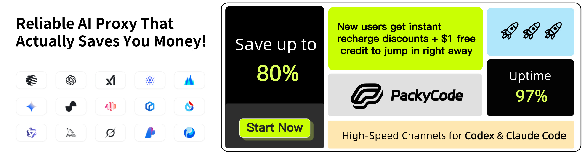

# CLIProxyAPI Plus

[English](README.md) | [中文](README_CN.md) | 日本語

デスクトップで CLIProxyAPI を利用したい場合は、[EasyCLIProxyAPI](https://github.com/router-for-me/EasyCLIProxyAPI) デスクトップクライアントをおすすめします。グラフィカルな設定画面、自動更新、システムトレイ連携、CLIProxyAPI サービスのワンクリック起動/停止などの機能を提供します。

CLIProxyAPI は、CLI向けのOpenAI/Gemini/Claude/Codex/Grok互換APIインターフェースを提供するプロキシサーバーです。

ローカル環境や複数のCLIアカウントを通じて、OpenAI（Responses含む）、Gemini（Interactions含む）、またはClaude互換のクライアントやSDKから、以下のプロバイダーにアクセスできます。

<table>
<tbody>
    <tr>
        <th align="center" width="100">プロバイダー</th>
        <th align="center">説明</th>
    </tr>
    <tr>
        <td align="center"><a href="https://www.kimi.com/code/?aff=cliproxyapi"></a></td>
        <td>Kimiシリーズモデル（Kimi K3、Kimi K2.7 Codeなど）。<a href="https://platform.kimi.ai/docs/guide/kimi-k3-quickstart">Kimi K3</a>は、Moonshot AIで最も高性能なモデルであり、世界初のオープンな3兆パラメータ級モデルです。2.8兆のパラメータ、ネイティブな視覚機能、100万トークンのコンテキストウィンドウを備え、長期間にわたるコーディング、知識作業、推論向けに構築されています。CLIProxyAPIはOAuthまたは互換APIインターフェース経由でKimiをサポートします。<a href="https://www.kimi.com/code/?aff=cliproxyapi">Kimi Codeサブスクリプション</a>を試すか、<a href="https://platform.kimi.ai?track_id=track-8a28e4b291d84f62af2fccc3e7a21cb3&aff=cliproxyapi">Kimi Open Platform</a>でAPIキーを取得してください。CLIProxyAPIとオープンソースコミュニティを支援してくださるKimiに感謝します！</td>
    </tr>
    <tr>
        <td align="center"><a href="https://platform.openai.com/docs/guide/gpt-5.6"></a></td>
        <td>OpenAI GPTシリーズモデル（GPT 5.6、GPT 5.5など）。GPT-5.6は、複雑な本番ワークフロー向けに新しい品質と効率の基準を打ち立てます。GPT-5.6は特にトークン効率が高く、レイアウト、視覚的階層、デザイン判断を含むフロントエンドの美的品質も向上しています。</td>
    </tr>
    <tr>
        <td align="center"><a href="https://www.anthropic.com/claude"></a></td>
        <td>Anthropic Claudeシリーズモデル（Claude Fable、Claude Opus、Claude Sonnetなど）。Claude Fable 5は、Anthropicが広く公開している中で最も高性能なモデルであり、最も要求の厳しい推論と長期間のエージェント作業向けに構築されています。</td>
    </tr>
    <tr>
        <td align="center"><a href="https://antigravity.google/"></a></td>
        <td>Google Geminiシリーズモデル（Gemini 3.5 Flash、Gemini 3.1 Proなど）。Gemini 3.5 Flashは、実世界タスク向けに最適化された持続的なフロンティア級の知能を、より高速かつ低コストで提供します。エージェント時代向けに設計されており、サブエージェント展開、多段階ワークフロー、大規模な長期間タスクに優れています。このモデルは、複雑なコーディングサイクルと反復を含む迅速なエージェントループに特に効果的です。</td>
    </tr>
    <tr>
        <td align="center"><a href="https://x.ai/grok"></a></td>
        <td>xAI Grokシリーズモデル（Grok 4.5、Grok Composer 2.5 Fastなど）。Grok 4.5は、コーディング、エージェントタスク、知識作業向けに構築されたSpaceXAIのフロンティアモデルです。科学、工学、数学にわたる新しいデータセットを用いて、SpaceXAIのメンフィスにあるデータセンターで訓練されました。</td>
    </tr>
</tbody>
</table>

## スポンサー

[](https://www.packyapi.com/register?aff=cliproxyapi)

PackyCodeのスポンサーシップに感謝します！

PackyCodeは信頼性が高く効率的なAPIリレーサービスプロバイダーで、Claude Code、Codex、Geminiなどのリレーサービスを提供しています。

PackyCodeは当ソフトウェアのユーザーに特別割引を提供しています：<a href="https://www.packyapi.com/register?aff=cliproxyapi">こちらのリンク</a>から登録し、チャージ時にプロモーションコード「cliproxyapi」を入力すると10%割引になります。

---

<table>
<tbody>
<tr>
<td width="180"><a href="https://www.aicodemirror.ai/register?invitecode=TJNAIF"></a></td>
<td>AICodeMirrorのスポンサーシップに感謝します！AICodeMirrorはClaude Code / Codex / Gemini向けの公式高安定性リレーサービスを提供しており、エンタープライズグレードの同時接続、迅速な請求書発行、24時間365日の専任技術サポートを備えています。Claude Code / Codex / Geminiの公式チャネルが元の価格の38% / 2% / 9%で利用でき、チャージ時にはさらに割引があります！CLIProxyAPIユーザー向けの特別特典：<a href="https://www.aicodemirror.ai/register?invitecode=TJNAIF">こちらのリンク</a>から登録すると、初回チャージが20%割引になり、エンタープライズのお客様は最大25%割引を受けられます！</td>
</tr>
<tr>
<td width="180"><a href="https://shop.bmoplus.com/?utm_source=github"></a></td>
<td>本プロジェクトにご支援いただいた BmoPlus に感謝いたします！BmoPlusは、AIサブスクリプションのヘビーユーザー向けに特化した信頼性の高いAIアカウントサービスプロバイダーであり、安定した ChatGPT Plus / ChatGPT Pro (完全保証) / Claude Pro / Super Grok / Gemini Pro の公式代行チャージおよび即納アカウントを提供しています。こちらの<a href="https://shop.bmoplus.com/?utm_source=github">BmoPlus AIアカウント専門店/代行チャージ</a>経由でご登録・ご注文いただいたユーザー様は、GPTを <b>公式サイト価格の約1割（90% OFF）</b> という驚異的な価格でご利用いただけます！</td>
</tr>
<tr>
<td width="180"><a href="https://apikey.fun/register?aff=CLIProxyAPI"></a></td>
<td>APIKEY.FUNのスポンサーシップに感謝します！APIKEY.FUNはプロフェッショナルなエンタープライズ向けAIリレーサービスで、企業および個人開発者に安定・高効率・低コストなAIモデルAPI接続サービスを提供しています。Claude、OpenAI、Geminiなどの主要人気モデルに対応し、価格は公式価格の7%から利用できます。本プロジェクトの<a href="https://apikey.fun/register?aff=CLIProxyAPI">専用リンク</a>から登録すると、さらに<b>チャージが永続的に5%割引</b>となる特別優待を受けられます。</td>
</tr>
<tr>
<td width="180"><a href="https://runapi.host/register?aff=FivD"></a></td>
<td>RunAPIは高効率で安定したAPIプラットフォームで、OpenRouterの代替として利用できます。1つのAPI KeyでOpenAI、Claude、Gemini、DeepSeek、Grokなど150以上の主要モデルにアクセスでき、価格は公式価格の10%から、非常に安定しており、Claude Code、OpenClawなどのツールとシームレスに互換性があります。RunAPIはCPAユーザー向けに特別特典を提供しています：<a href="https://runapi.host/register?aff=FivD">登録</a>後に管理者へ連絡すると、7元分の無料クレジットを受け取れます。</td>
</tr>
<tr>
<td width="180"><a href="https://t.me/CyberWlD/218"></a></td>
<td>CyberPay（サイバー決済）は2021年に設立されました。AI業界の事業者向けに、安定・高効率・安全な決済精算ソリューションを提供することに取り組んでいます。私たちと連携することで、WebサイトやプラットフォームでのAlipay/WeChat決済の受け取り課題を解決できます。GPT、Gemini、Claude、Codexアカウントやリレープラットフォームなど、各種事業提携にも対応し、事業者の決済回収に関する課題を解決します。<a href="https://t.me/CyberWlD/218">お問い合わせ</a>ください。</td>
</tr>
<tr>
<td width="180"><a href="https://console.apito.ai/agent/register/pJq9T52Fpugrhpgo"></a></td>
<td>本プロジェクトは <a href="https://console.apito.ai/agent/register/pJq9T52Fpugrhpgo">Claude API</a> にご支援いただいています！Claude API は Claude モデルに特化した公式チャネルの API プロバイダーです。Anthropic 公式 Key と AWS Bedrock の公式チャネルを基盤に、Claude Code と Agent アプリケーション向けに安定した接続体験を提供します。Claude 全シリーズのモデルに対応し、Tool Use や長いコンテキストなどの公式機能も維持されています。リバースエンジニアリングではなく、モデル性能のダウングレードもありません。Claude Code のヘビーユーザー、Agent エンジニア、企業の技術チームに適しています。<a href="https://console.apito.ai/agent/register/pJq9T52Fpugrhpgo">専用リンク</a> から登録後、カスタマーサポートに連絡すると無料テストクレジットを受け取れます。請求書発行やチーム導入の相談にも対応しています。</td>
</tr>
<tr>
<td width="180"><a href="https://code0.ai/agent/register/slxVMR3uVBoRgNBf"></a></td>
<td>本プロジェクトは <a href="https://code0.ai/agent/register/slxVMR3uVBoRgNBf">Code0</a> にご支援いただいています！code0.ai は、開発者と技術チーム向けの AI コーディングワークスペースです。Claude Code や Codex などの主要な Agent 型コーディング機能を統合し、コード生成、プロジェクト理解、デバッグ、コードレビュー、ドキュメント作成など、日常的な開発シーンをサポートします。個人開発者、Agent エンジニア、オープンソースメンテナー、企業の開発チームに適しており、請求書発行やチーム導入にも対応しています。<a href="https://code0.ai/agent/register/slxVMR3uVBoRgNBf">専用リンク</a> から登録後、カスタマーサポートに連絡すると無料テストクレジットを受け取れます。より効率的な AI コーディングワークフローをぜひ体験してください。</td>
</tr>
<tr>
<td width="180"><a href="https://api.fenno.ai/s/Cvf0"></a></td>
<td>FennoAI は、安定性と効率性に優れた API リレーサービスプロバイダーで、現在は主に Codex リレーサービスを提供しています。OpenAI および Anthropic プロトコルに対応し、Codex、Claude Code、OpenCode などの主要なコーディングツールへ柔軟に接続できます。1日あたり数千億 Token 規模のエンタープライズ利用を安定して支え、国内および海外法人向けの企業間決済と請求書発行にも対応しています。FennoAI は CLIProxyAPI ユーザー限定の特典を提供しています。<a href="https://api.fenno.ai/s/Cvf0">専用リンク</a>からサブスクリプションを購入すると、わずか 1.99 ドルで 50 ドル相当の Coding Plan クレジットを獲得できます。さらに紹介報酬にも対応しており、招待した友人が購入すると最大 20% のコミッションを獲得できます。招待が多いほど、報酬も高くなります。</td>
</tr>
<tr>
<td width="180"><a href="https://s.qiniu.com/7zUJri"></a></td>
<td>本プロジェクトは <a href="https://s.qiniu.com/7zUJri">七牛雲AI</a> にご支援いただいています！七牛雲AI は七牛雲（02567.HK）傘下のエンタープライズ向け大規模モデル MaaS プラットフォームです。世界の主要モデル150以上をワンストップで呼び出せ、世界の主要モデルプロバイダーのプロトコルに対応し、テキスト、画像、音声、動画、ファイル処理などのフルモーダル処理能力をカバーしています。169万を超える企業および開発者ユーザーにサービスを提供しています。専用特典：企業ユーザーは <b>1,200万 Token</b> を無料で受け取れ、友人招待で最大100億 Tokenを獲得できます。</td>
</tr>
<tr>
<td width="180"><a href="https://cubence.com/signup?code=CLIPROXYAPI&source=cpa"></a></td>
<td>Cubenceのスポンサーシップに感謝します！Cubenceは信頼性が高く効率的なAPIリレーサービスプロバイダーで、Claude Code、Codex、Geminiなどのリレーサービスを提供しています。Cubenceは当ソフトウェアのユーザーに特別割引を提供しています：<a href="https://cubence.com/signup?code=CLIPROXYAPI&source=cpa">こちらのリンク</a>から登録し、チャージ時にプロモーションコード「CLIPROXYAPI」を入力すると10%割引になります。</td>
</tr>
<tr>
<td width="180"><a href="https://www.fastaitoken.com/"></a></td>
<td><a href="https://www.fastaitoken.com/">FastAIToken</a> のスポンサーシップに感謝します！FastAIToken は開発者向けの AI API 集約プラットフォームで、速度と安定性を重視しています。OpenAI、Claude、Gemini などの主要 AI モデルに対応し、チャージ比率は 1:1（1元 = 1ドル分の API クレジット）のため、開発者はより低コストで便利に世界トップクラスの AI モデルを利用できます。<a href="https://t.me/+stwq0MLi0PtkZTZl">Telegram サポートグループ</a><br/>プラットフォームでは用途に応じて複数のチャネルを選択できます：超低価格の 0.02× OpenAI プロモーション枠（期間限定）、0.25× からの OpenAI チャネル、95% 固定キャッシュの 0.7× Claude、1.2× Claude Max チャネル。また、各チャネルの稼働率、遅延、運用状況をリアルタイム表示する公開ステータスページも提供しており、透明で信頼性の高いサービスを実現しています。さらに FastAIToken は 24時間365日の真人テクニカルサポート（ボットではありません）を提供し、開発者のニーズに迅速に対応します。エンタープライズ顧客向けには、安定性を保証する SLA 対応の専用チャネルプールを提供し、契約対応、請求書発行、専任保守にも対応しています。</td>
</tr>
<tr>
<td width="180"><a href="https://api.lmuai.ai/register?promo=CLIPROXYAPI-%E4%BC%98%E6%83%A0%E7%A0%81"></a></td>
<td><a href="https://api.lmuai.ai/register?promo=CLIPROXYAPI-%E4%BC%98%E6%83%A0%E7%A0%81">LMU（灵眸 AI）</a>による本プロジェクトへのご支援に感謝します！LMUは、Claude Code、Codex、その他のコーディングエージェント向けのAnthropicおよびOpenAI互換リレーサービスで、中国国内モデル（DeepSeek、GLM、Qwenなど）と主要な海外プロバイダーの両方に対応しています。<code>ANTHROPIC_BASE_URL</code>をLMUエンドポイントに設定するだけで、コードを変更せずに標準の<code>/v1/messages</code> API経由で接続できます。実際のClaude CodeセッションではPrompt Cacheのヒット率が90%を超えており、長時間のセッションにかかるコストを削減できます。未使用のチャージ残高は申請により返金可能です。エンタープライズプランでは、グループ化されたチーム管理のAPIキーを利用でき、IP・クォータ制限、レートウィンドウ、有効期限を設定できるほか、トラフィック監視と請求書発行にも対応しています。<a href="https://api.lmuai.ai/register?promo=CLIPROXYAPI-%E4%BC%98%E6%83%A0%E7%A0%81">LMU CLIProxyAPI専用リンク</a>から登録すると、無料テストクレジットを受け取れます。</td>
</tr>
<tr>
<td width="180"><a href="https://www.infistar.cc/register?aff=FQKC6J6R&ref_source=link"></a></td>
<td>モデルの水増し、性能低下、あるいは不透明な価格設定が心配ですか？世界をリードするモデル集約サービス Infistar.ai では、提供するすべてのモデルを実際の呼び出しによって検証しています。供給元は公式 API と公式アカウントプールで、10,000 を超える供給経路を負荷分散し、低遅延とピーク時の安定性を確保します。ChatGPT、Claude、Gemini、Grok、GLM、DeepSeek、Kimi、Qwen、MiniMax など国内外の主要モデルを網羅し、テキスト、動画、画像、埋め込み、リランキングなどのフルモーダル機能に対応しています。価格と利用量は透明かつ明確で確認しやすく、モデルは公式価格の 10% から利用できます。CLIProxyAPI ユーザーは専用入口から登録してお試しいただけます。招待リンク：<a href="https://www.infistar.cc/register?aff=FQKC6J6R&ref_source=link">https://www.infistar.cc/register?aff=FQKC6J6R&ref_source=link</a></td>
</tr>
<tr>
<td width="180"><a href="https://go.apimart.ai/gh-cliproxyapi"></a></td>
<td>APIMartによる本プロジェクトへのご支援に感謝します！APIMartは、AI画像・動画生成に特化した低価格APIプラットフォームです。GPT-Image-2は1枚あたりわずか&#36;0.006で、1ドルで160枚以上の画像を生成できます。画像と動画の両方を1つの非同期APIで扱えます。タスクを送信してIDを取得し、ポーリングまたはコールバックで結果を受け取れます。数万枚規模の画像をタイムアウトなしでバッチ生成でき、コードを変更せずにモデルを切り替えられます。従量課金制で月額料金は不要です。<a href="https://go.apimart.ai/gh-cliproxyapi">こちらの登録リンク</a>からすぐに始められます。</td>
</tr>
</tbody>
</table>

## 概要

- CLIモデル向けのOpenAI/Gemini/Claude/Grok互換APIエンドポイント
- OAuthログインによるOpenAI Codexサポート（GPTモデル）
- OAuthログインによるClaude Codeサポート
- OAuthログインによるGrok Buildサポート
- ストリーミング、非ストリーミング、および対応環境でのWebSocketレスポンス
- 関数呼び出し/ツールのサポート
- マルチモーダル入力サポート（テキストと画像）
- ラウンドロビン負荷分散による複数アカウント対応（Gemini、OpenAI、Claude、Grok）
- シンプルなCLI認証フロー（Gemini、OpenAI、Claude、Grok）
- Generative Language APIキーのサポート
- AI Studioビルドのマルチアカウント負荷分散
- Claude Codeのマルチアカウント負荷分散
- OpenAI Codexのマルチアカウント負荷分散
- Grok Buildのマルチアカウント負荷分散
- 設定によるOpenAI互換アップストリームプロバイダー（例：OpenRouter）
- プロキシ埋め込み用の再利用可能なGo SDK（`docs/sdk-usage.md`を参照）

- `router-for-me/CLIProxyAPI`: 上流のプロキシサーバー本体。
- `Tonkic/CLIProxyAPIPlus`: 追加 provider、ログイン機能、配布パッケージを含む Plus fork。
- `seakee/CPA-Manager-Plus`: 管理機能と使用量 dashboard を提供する外部アプリケーション。release パッケージではバイナリとして同梱されます。
- このリポジトリの統合コード: proxy の usage event を Redis 互換 queue として公開し、proxy と manager を一緒に動かせるようにします。

目的は、上流 CLIProxyAPI との互換性を保ちながら、Plus 固有の provider、多アカウント管理、使用量収集、簡単なデプロイを提供することです。

## 機能

- OpenAI、Gemini、Claude、Codex、Grok、Responses 互換 API。
- Codex、Claude、Gemini、Kimi、Antigravity、xAI/Grok、GitHub Copilot、Kiro、Cursor、CodeBuddy、Kilo、iFlow、GitLab Duo などのログインまたは token 接続。
- round-robin / fill-first のアカウント選択、model alias、hot reload。
- Amp CLI と Amp IDE extension 用の provider route。
- 対応 provider での WebSocket。
- request log、Management API、管理パネル。
- 外部 collector が消費できる Redis 互換 usage queue。
- CLIProxyAPI Plus と CPA-Manager-Plus をまとめて起動できる release helper。

## 構成

```text
cmd/server/                  CLI entrypoint
internal/api/                Gin server, routes, middleware, Management API
internal/api/modules/amp/    Amp routes and reverse proxy helpers
internal/runtime/executor/   provider executors
internal/translator/         protocol translators
internal/redisqueue/         Redis-compatible usage queue plugin
sdk/cliproxy/                embeddable proxy service
sdk/cliproxy/usage/          usage event manager and plugin interface
manager/                     CPA-Manager-Plus binary and persistent data
docs/                        SDK and provider documentation
```

## 使用量収集

CLIProxyAPI Plus は runtime で usage record を生成し、`sdk/cliproxy/usage` から publish します。`internal/redisqueue` plugin は record を JSON に変換し、memory queue に保存します。

API server は proxy と同じ port で Redis RESP 接続も受け付けます。consumer は management key で認証し、`LPOP` または `RPOP` で event を読み取ります。

CPA-Manager-Plus はこの queue を消費し、永続化、service management、可視化を行います。

既定の構成:

```text
client -> CLIProxyAPI Plus :8317 -> Redis-compatible usage queue
                              |
                              v
                         CPA-Manager-Plus :18317
```

proxy config:

```yaml
remote-management:
  secret-key: "change-me"

usage-statistics-enabled: true
redis-usage-queue-retention-seconds: 60
```

初回起動後、`http://SERVER_IP:18317/management.html` を開きます。自動生成された CPA-Manager-Plus admin key でログインし、CLIProxyAPI Plus の URL に `http://127.0.0.1:8317`、key に CPA の management key を設定します。manager は既定で `USAGE_COLLECTOR_MODE=auto` を使用します。

## Quick Start

```bash
cp config.example.yaml config.yaml
go run ./cmd/server --config ./config.yaml
```

Build:

```bash
go build -o cli-proxy-api-plus ./cmd/server
./cli-proxy-api-plus --config ./config.yaml
```

## CPA-Manager-Plus と一緒に起動

release archive には短い Linux helper scripts と CPA-Manager-Plus binary が含まれます。

```text
CLIProxyAPIPlus_<version>_linux_<arch>/
|-- cli-proxy-api-plus
|-- config.example.yaml
|-- start.sh
|-- stop.sh
|-- restart.sh
|-- update.sh
`-- manager/
    `-- cpa-manager-plus
```

Initial setup:

```bash
cp config.example.yaml config.yaml
./start.sh
```

Service control:

```bash
./start.sh
./stop.sh
./restart.sh
```

起動されるサービス:

- CLIProxyAPI Plus: `http://127.0.0.1:8317`
- CPA-Manager-Plus: `http://127.0.0.1:18317`

CPA-Manager-Plus は初回起動時に `cpamp_...` admin key を生成します。次の log で確認できます。

```bash
tail -n 200 logs/cpa-manager-plus.out.log
tail -n 200 logs/cpa-manager-plus.err.log
```

manager の永続データは `manager/data/` と `manager/config.json` に保存されます。`manager/data/usage.sqlite*` と `manager/data/data.key` を backup してください。update script は manager binary のみを置き換え、これらのファイルを保持します。

## Update

デフォルトでは GitHub Release から直接 download します。

```bash
./update.sh --tag v7.2.91.1
```

Install only, then restart manually:

```bash
./update.sh \
  --tag v7.2.91.1 \
  --no-restart

./restart.sh
```

Aliyun OSS は optional mirror として引き続き利用できます。`--bucket` と `--endpoint` を指定してください。

## Amp CLI Support

- `/api/provider/{provider}/v1/messages`
- `/api/provider/{provider}/v1beta/models/...`
- `/api/provider/{provider}/v1/chat/completions`

management proxy、model fallback、model mapping、sensitive Amp management route の localhost 制限も含まれます。

## Build And Test

```bash
gofmt -w .
go build -o test-output ./cmd/server
rm -f test-output
go test ./...
```

## Upstream Projects

- CLIProxyAPI: `https://github.com/router-for-me/CLIProxyAPI`
- CLIProxyAPI Plus: `https://github.com/Tonkic/CLIProxyAPIPlus`
- CPA-Manager-Plus: `https://github.com/seakee/CPA-Manager-Plus`

## License

MIT License。詳細は [LICENSE](LICENSE) を参照してください。
